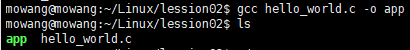
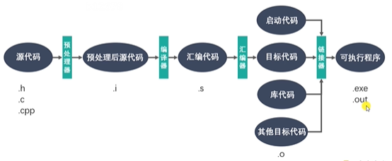

# GCC
## GCC概述
```
\\GCC 原名 GNU C语言编译器；
\\GCC(GNU Compiler Collection，GNU编译套件)，是由GNU开发的编程语言编译器，套件包括C\C++\Objective-C\Java\Ada\Go语言前端，也包括这些语言的库；
\\GCC不仅支持C的“方言”，也可区分不同C语言便准；可使用命令行选项控制翻译源代码的C标准；当使用命令行参数 `-std=c99` 启动GCC时，编译器支持C99标准；
sudo apt install gcc g++ \\安装命令，版本>4.8.5
gcc/g++ -v/--version \\查看版本
```
- gcc 一般用来编译C程序
- g++ 一般用来编译C++程序，同时也能用来编译C程序

## GCC安装
### apt-get命令下载安装应用报错
- ubuntu提示E: 无法获得锁 /var/lib/dpkg/lock-frontend - open (11: 资源暂时不可用)
    - 原因
        - 可能是上次安装时没正常完成，而导致出现此状况。
    - 解决方案
        - 运行强制解锁命令
        ```
        sudo rm /var/cache/apt/archives/lock
        sudo rm /var/lib/dpkg/lock
        ```
        - 重启
        
## GCC调用
### 生成可执行文件
- 相应命令
```
gcc test.c -o app
\\test.c 为待翻译编译源代码
\\app 为生成的可执行文件，当没有自定义可执行文件命名时，默认输出可执行文件为a.out
```
- Linux系统下可执行文件在命令行模式下均为绿色

     
- 运行可执行文件（在对应目录下）
```
./app
```

## GCC工作流程



- `-On`代码优化能够有效防止反汇编代码。

## gcc和g++区别
- gcc 和 g++ 都是GNU的一个编译器
    - 误区一：gcc只能编译c代码，g++只能编译c++代码。
        - 两者都可以，注意：
        ```
        后缀为 .c 的，gcc当作c程序，g++当作c++程序；
        后缀为 .cpp 的，两者都会认为是c++程序；
        编译阶段，g++会调用 gcc，**对于c++代码，两者是等价的**，但是gcc命令不能自动和C++程序使用的库链接，通常用g++完成链接，为了统一起见，统统采用 g++ 。
        ```
    - 误区二： gcc不会定义_cplusplus 宏，而g++会
        - 实际上，这个宏只是标志着编译器将会把代码按C还是C++语法来解释
        - 如上所述，如果后缀为﹒c，并且采用gcc 编译器，则该宏就是未定义的，否则，就是已定义
    - 误区三：编译只能用gcc，链接只能用g++
        - 严格来说，这句话不算错误，但是它混淆了概念，应该这样说：编译可以用 gcc/g++，而链接可以用g++或者gcc -lstdc++
        - gcc命令不能自动和C++程序使用的库联接，所以通常使用g++来完成联接。但在**编译阶段， g++会自动调用gcc，二者等价**

