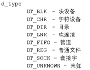

# IO函数
## 文件IO
### 文件角度
- 文件角度的输入：是从外部（内存）写入到文件
- 文件角度的输出：从文件将数据读取到内存

### 内存角度
- 输入：从文件将数据读取到内存
- 输出：从内存将数据写到文件中
- 🐖 对于程序中，文件的读写是以内存角度进行输入输出

## 标准C库（第三方库）IO函数

### 特点
- 标准C库IO函数是可以跨平台的
    - 实现方式：在各个平台上调用不同系统平台的api
- 与Linux平台的IO函数是调用关系，即标准C库IO函数调用Linux的IO函数。

### 文件描述符
- 用来指向一个已经打开的文件
- 在Linux中一般称为文件描述符，win平台一般称为文件句柄

### 文件读写指针

### I/O缓冲区
- 所用C库函数都是带有缓冲区的
- 作用：提高程序执行效率（降低磁盘写入次数）。数据先依次写入缓冲区，再一次性将缓冲区数据刷新到磁盘
- 强制刷新缓冲区函数：`fflush( )`
- 缓冲区默认大小为：8192byte（8k），一般不建议调整

## 标准C库IO和Linux系统IO关系


## 虚拟地址空间

- 虚拟地址空间是不存在的，是由程序员想象出来的
- 一个应用程序运行后对应一个进程，会有一个虚拟地址空间，虚拟空间的大小由电脑的cpu决定的。如32位的计算机的虚拟空间大小为$2^{32}$（大概4G），64位的机器的虚拟空间大小为$2^{48}$.
    - 📕 程序和进程的区别在于：程序不占用内存空间，只占用磁盘空间；当程序运行时操作系统会为其运行分配资源，操作系统创建进程为程序分配资源，占用内存空间。
- 虚拟空间中的数据会被CPU中的内存管理单元MMU映射到物理内存中，MMU能将虚拟地址和物理地址进行转换。
- 虚拟地址空间实际不会占有物理地址空间4G
- 常见的32位计算机中，虚拟地址空间的0-3G为用户区，剩下1G为内核区，**普通用户无法对内核区进行操作**。
- 用户区
    - 受保护地址（0-4k），像空指针Null，nullptr位于这部分空间
    - .text，代码段，均为二进制机器指令
    - .data，存放已初始化全局变量
    - .bss，存放为初始化全局变量
    - 堆空间，可通过 `new` 和 `malloc` 进行创建，一般比栈空间大，数据从**低地址->高地址**存取
    - 共享库
    - 栈空间，数据从上往下（**高地址->低地址**）存取
    - 命令行参数
    - 环境变量
- 内核区
    - 可以通过系统调用（调用系统API）对内核区中数据进行读取修改操作，普通用户不能对该空间进行读写操作
    - 内存管理
    - 进程管理
    - 设备驱动管理
    - VFS虚拟文件系统

## 文件描述符

### 概述
- 文件描述符表位于内核区（3G~4G），由内核进程控制块（PCB）进行管理。
    - PCB为一个结构体，文件描述符表是结构体中的一个数组，每一个文件描述符都可以定一个文件。
    - 文件描述符表的默认数组大小为1024，即每一个进程对应能同时打开的文件个数为1024（其中前三个是被默认占用打开的，分别为标准输入、标准输出、标准错误）。
    - 🐖 Linux系统中：“一切皆文件”。
        - 硬件设备会被虚拟成一个设备文件（终端）
- 文件描述符可以对应同一个文件，即多次调用 `fopen()` 定位的文件描述符是不一样的。
- 当使用 `fclose` 或 Linux 系统IO函数close，释放文件描述符。
- 每次打开文件占用的文件描述符是空闲的最小文件描述符。

## Linux系统API
### 主要Linux系统IO函数
- `int open(const char *pathname, int flags);`
- `int open(const char *pathname, int flags, mode_t mode);`
- `int close(int fd);`
- `ssize_t read(int fd, void *buf, size_t count);`
- `ssize_t write(int fd, const void *buf, size_t count);`
- `off_t lseek(int fd, off_t offset, int whence);`
- 🌂 查看Linux系统手册API部分命令
    -  `man 2 函数名` .

### open函数
#### open函数打开文件
```
/*
    #include <sys/types.h>
    #include <sys/stat.h>
    #include <fcntl.h>

    //C语言中没有函数重载
    //此处两个open是通过一个可变参数，实现C++中函数重载的效果

    //功能：
    //      打开一个已经存在的文件
    //参数：
    //      - pathname：要打开的文件路径
    //      - flags：对文件的操作权限(3个参数互斥）还有其他设置
    //              (O_RDONLY, O_WRONLY, O_RDWR)
    //返回值：
    //      返回一个新的文件描述符，如果调用失败，返回-1
    //errno：
    //      属于Linux系统函数库，库里面的一个全局变量，记录的是最近的错误号
    //      通过perror()对错误码对应的错误描述进行打印              
    int open(const char *pathname, int flags);

    int open(const char *pathname, int flags, mode_t mode);
*/

#include <sys/types.h>
#include <sys/stat.h>
#include <fcntl.h>
#include <stdio.h>
#include <unistd.h>

int main()
{
    int fd = open("a.txt", O_RDONLY);

    if(fd == -1)
    {
        perror("open");
    }

    //关闭
    close(fd);

    return 0;
}

\\运行结果：
\\        mowang@mowang:~/Linux/lesson09$ gcc open.c -o open
\\        mowang@mowang:~/Linux/lesson09$ ls
\\        open  open.c
\\        mowang@mowang:~/Linux/lesson09$ ./open
\\        open: No such file or directory
```
- 错误号：在Linux系统中，每个错误都对应一个错误号，当进行系统调用发生错误时，会把该最近调用的错误号赋值到errno
- perror函数
    ```
    #include <stdio.h>
    //属于标准C库函数
    //作用：打印errno对应的错误描述
    //参数：
    //    s参数为用户描述，例如hello,最终的输出内容格式为：hello:xxx(实际的错误描述)
    void perror(const char *s);
    ```

#### open创建新文件
```
/*
    int open(const char *pathname, int flags, mode_t mode);
    参数：
        - pathname：要创建文件的路径
        - flags：对文件的操作权限和其他设置
            - 互斥的必选项：O_RDONLY, O_WRONLY, O_RDWR
            - 可选项：(可选项和必选项之间用‘|’分隔)
                - O_APPEND：文件内容追加
                - O_CREAT：文件不存在，创建新文件
            - int类型数据，占4字节，32个Bit位，每一位对应一个标志位
        - mode：八进制的数，表示用户对创建出的新的文件的操作权限
            - 新创建文件的操作权限为：mode & ~umask
            - 对umask取反相当于用最大值减去umask，例如umask=0002,则~mask=0775
            - umask的作用：抹去部分权限
*/

#include <sys/types.h>
#include <sys/stat.h>
#include <fcntl.h>
#include <stdio.h>
#include <unistd.h>

int main()
{
    // 创建新的文件
    int fd = open("create.txt", O_RDWR | O_CREAT, 0777);

    if(fd == -1)
    {
        perror("open_create");
    }

    close(fd);  //关闭

    return 0;
}

\\运行结果：
\\        mowang@mowang:~/Linux/lesson09$ gcc create.c -o create
\\        mowang@mowang:~/Linux/lesson09$ ./create
\\        mowang@mowang:~/Linux/lesson09$ ls
\\        create  create.c  create.txt  open  open.c
\\        mowang@mowang:~/Linux/lesson09$ ll create.txt
\\        -rwxrwxr-x 1 mowang mowang 0 2月  10 19:29 create.txt*
```

- 文件的读写权限
    - Linux系统下每个文件都有读写权限，每个权限由3个块组成，每个块对应一个八进制数，转换成3位二进制数分别对应可读、可写、可执行的三种权限。
    - 
    - 三个组块权限分别对应：当前用户对文件的权限、当前用户所在组对文件的权限、其他组对文件的权限
    - 🐖 `umask 3位八进制数` 命令
        - 可以用来查看当前路径屏蔽权限
        - 仅对当前终端有效
        - 在程序中，可以调用Linux系统函数 `mode_t umask(mode_t mask);` 对umask进行设置。
- 参数flags和mode_t的区别
    - `flags` 标记分别表示以只读、只写或读/写方式打开文件。
    - 这个参数是表示在程序运行的时候，能以什么权限对文件进行操作，如果代码中只设置了只读，那么程序中就不能对文件进行写操作。
    - `mode_t mode` 是文件的本身权限。

### read/write函数
#### read函数
```
/*
    #include <unistd.h>
    ssize_t read(int fd, void *buf, size_t count);
        参数：
            -fd：文件描述符，通过open函数得到，通过文件描述符操作对应文件
            -buf：（传出参数）指针类型，缓冲区，需要读取数据存放的地方
            -count：指定的数组的大小，指定buf的容量大小，但并不是每次读取数据都是这个数组大小
        返回值：
            - 成功时
                - >0，返回读取到的字节的数量
                - 0，已读到文件末尾，文件读取完毕
            - 失败
                - -1，出现错误，并设置errno
*/
```
- 📕 传出参数：例如read( ) 的参数 buf，即给定一个空的数组，用来保存具体的数据，通过读取这个数组获取数据。

#### write函数
```
/*
    #include <unistd.h>
    ssize_t write(int fd, const void *buf, size_t count);    
        参数：
            - fd：文件描述符，通过open函数得到，通过文件描述符操作对应文件
            - buf：要往磁盘写入数据的缓冲保存数组
            - count：要写入数据的实际大小
                - 如果大于缓冲区的实际大小，会把缓冲区后面的内存中的数据读写进去，只不过这些数据我们是不确定的，是野内存，操作野内存有可能会产生问题，所以一般不会这么去做。缓冲区中有多少数据，我们就写多少数据即可。
        返回值：
            - 成功：实际写入字节数
            - 失败：返回-1，并设置errno
*/
```
- 示例

```
#include <unistd.h>
#include <stdio.h>
#include <sys/types.h>
#include <sys/stat.h>
#include <fcntl.h>

int main()
{
    //1.通过open打开样例english.txt文件
    //open函数注意相对路径和绝对路径
    int srcfd = open("english.txt", O_RDONLY);
    if(srcfd == -1)
    {
        perror("open");
        return -1;
    }

    //2.创建一个新的文件（拷贝文件）
    int destfd = open("cpy.txt", O_WRONLY | O_CREAT, 0664);
    if(destfd == -1)
    {
        perror("open_create");
        return -1;
    }

    //3.重复读写操作
    char buf[1024] = {0};
    int len = 0;
    while((len = read(srcfd, buf, sizeof(buf))) > 0)
    {
        write(destfd, buf, len);
    }

    //4.关闭文件
    close(destfd);
    close(srcfd);
    
    return 0;
}
//运行结果：
//        mowang@mowang:~/Linux/lesson10$ gcc copyfile.c -o copy
//        mowang@mowang:~/Linux/lesson10$ ./copy
//        mowang@mowang:~/Linux/lesson10$ ll
//        -rwxrwxr-x  1 mowang mowang   8528 2月  11 13:11 copy*
//        -rw-rw-r--  1 mowang mowang   1898 2月  11 13:10 copyfile.c
//        -rwxrw-rw-  1 mowang mowang 129772 2月  11 13:11 cpy.txt*
//        -rwxrw-rw-  1 mowang mowang 129772 12月 13  2020 english.txt*
```


### lseek函数
- 概述

```
/*
- 标准C库函数
    #include <stdio.h>
    int fseek(FILE *stream, long offset, int whence);
- Linux系统函数
    #include <sys/types.h>
    #include <unistd.h>
    off_t lseek(int fd, off_t offset, int whence);
        描述：
            - 对指定文件描述符对应文件的文件指针的偏移进行操作
        参数：
            - fd：文件描述符
            - offset：偏移量
                - off_t，同long类型相似
            - whence（同标准C库函数相同）：
                - SEEK_SET：The file offset is set to offset bytes.
                            （根据"offset"设置文件指针的偏移量）
                - SEEK_CUR：The file offset is set to its current location plus offset bytes.
                            （设置偏移量："当前位置+offset"）
                - SEEK_END：The file offset is set to the size of the file plus offset bytes.
                            （设置偏移量："文件大小+offset"）
        返回值：
            - 返回最终文件指针所在的位置
        作用：
            1.移动文件指针到文件头
                - lseek(fd, 0, SEEK_SET);
            2.通过返回值获取当前文件指针的位置
                - lseek(fd, 0, SEEK_CUR);
            3.获取文件长度
                - lseek(fd, 0, SEEK_END);
            4.拓展文件的长度（不等于拓展文件中的数据），例如当前文件10bytes,拓展为110bytes
                - lseek(fd, 100, SEEK_END);
                - write(fd, " ", 1);
*/
```

- 示例程序

```
#include <sys/types.h>
#include <unistd.h>
#include <stdio.h>
#include <sys/stat.h>
#include <fcntl.h>

int main()
{
    int fd = open("hello.txt", O_RDWR);

    if(fd == -1)
    {
        perror("open");
        return -1;
    }

    //拓展文件长度
    int ret = lseek(fd, 100, SEEK_END);
    if(ret == -1)
    {
        perror("lseek");
        return -1;
    }

    write(fd, " ", 1);

    close(fd);

    return 0;
}
```

- 用途：文件拓展
    - 例如：下载软件，下载的文件有5G，磁盘还有5G空间，下载过程中，如果使用了空间，那导致下载不成功，因为磁盘不够。所以我们先创建出一个那么5G的文件，你后续可以通过lseek移动指针到起始位置开始下载写入。

### stat/lstat函数
#### shell命令 `stat`
- 作用：查看指定路径下文件的相关信息
- 示例
    
- 文件信息说明
    - 大小，单位为字节
    - Inode，用来标识文件的值
    - 文件的权限
    ```
    读权限（r）表示只允许指定用户读取相应文件的内容，而禁止对它做任何的更改操作。将所访问的文件的内容作为输入的命令都需要有读的权限。例如cat、more等。
    写权限（w）表示允许指定用户打开并修改文件。例如命令vi、cp等。
    执行权限（x）表示允许指定用户将该文件作为一个程序执行。
    ```
    - 最近更改：文件数据和属性发生变化
    - 最近改动：仅文件属性发生变化才会更新

#### stat函数
- 概述
```
    #include <sys/types.h>
    #include <sys/stat.h>
    #include <unistd.h>

    int stat(const char *pathname, struct stat *statbuf);
    - 描述（作用）
        - 获取文件的相关信息，
    - 参数：
        - pathname：操作文件的路径
        - statbuf：结构体变量，传出参数，用于保存获取到的文件信息
    - 返回值：
        - 成功，返回0
        - 失败，返回-1，并且设置errno
```
- stat结构体
```
struct stat{
    dev_t       st_dev;         //文件的设备编号
    ino_t        st_ino;         //节点
    mode_t    st_mode;     //文件的类型和存取权限
    nlink_t      st_nlink;      //连接到该文件的硬连接数目
    uid_t        st_uid;         //用户ID
    gid_t        st_gid;         //组ID
    dev_t        st_rdev;       //设备文件的设备编号
    off_t         st_size;        //文件字节数（文件大小）
    blksize_t   st_blksize;    //块大小
    blkcnt_t    st_blocks;    //块数
    time_t       st_atime;     //最后一次访问时间
    time_t       st_mtime;    //最后一次修改时间
    time_t       st_ctime;     //最后一次改变时间（特指属性）
}
```
- 🐖 st_mode变量
    
    - 特殊权限位不用管
    - 判断权限（一个标志位）的方法
        - 将st_mode和对应权限的宏（如S_IXOTH）做 `&` 的操作
        - 文件类型的判断方法
            - 把文件类型的多个标志位筛选出来（和掩码宏定义S_IFREG相 `&`），再和对应标志宏进行比较
            - 示例：`(st_mode & S_IFMT)==S_IFREG`

#### lstat
- 功能也跟stat函数功能一样，仅有一点不同：stat函数是穿透（追踪）函数，即对软链接文件进行操作时，操作的是链接到的那一个文件，不是软链接文件本身；而lstat函数是不穿透（不追踪）函数，对软链接文件进行操作时，操作的是软链接文件本身。
- 创建软连接命令
    - `ln -s 文件名 链接文件名`
    - 

#### 模拟实现 `ls -l` 命令
- shell命令 `ls -l` / `ls -l 文件名`
    
    
- 案例代码

```
#include <sys/types.h>
#include <sys/stat.h>
#include <unistd.h>
#include <stdio.h>
#include <pwd.h>
#include <grp.h>
#include <time.h>

// 模拟实现 ls -l 指令
// -rw-rw-r-- 1 mowang mowang 14 2月  12 17:35 a.txt

int main(int argc, char *argv[])
{   
    //判断输入参数是否正确
    if(argc < 2)
    {
        printf("%s filename\n", argv[0]);
        return -1;
    }

    //通过stat函数获取
    struct stat st;
    int ret = stat(argv[1], &st);
    if(ret == -1)
    {
        perror("stat");
        return -1;
    }

    //获取文件类型和文件权限
    char perms[11] = {0};   //用于保存文件类型和文件劝降

    switch(st.st_mode & S_IFMT)
    {
        case S_IFLNK:
            perms[0] = 'l';
            break;
        case S_IFDIR:
            perms[0] = 'd';
            break;  
        case S_IFREG:
            perms[0] = '-';
            break;  
        case S_IFBLK:
            perms[0] = 'b';
            break;
        //...
        default:
            perms[0] = '?';
            break;
    }

    //判断文件的访问权限
    //文件所有者
    perms[1] = (st.st_mode & S_IRUSR) ? 'r' : '-';
    perms[2] = (st.st_mode & S_IWUSR) ? 'w' : '-';
    perms[3] = (st.st_mode & S_IXUSR) ? 'x' : '-';
    //文件所在组
    perms[4] = (st.st_mode & S_IRGRP) ? 'r' : '-';
    perms[5] = (st.st_mode & S_IWGRP) ? 'w' : '-';
    perms[6] = (st.st_mode & S_IXGRP) ? 'x' : '-';
    //其他人
    perms[7] = (st.st_mode & S_IROTH) ? 'r' : '-';
    perms[8] = (st.st_mode & S_IWOTH) ? 'w' : '-';
    perms[9] = (st.st_mode & S_IXOTH) ? 'x' : '-';

    //硬连接数
    int linkNum = st.st_nlink;

    //文件所有者
    char *fileUser = getpwuid(st.st_uid)->pw_name;

    //文件所在组
    char *fileGrp = getgrgid(st.st_gid)->gr_name;

    //文件大小
    long int fileSize = st.st_size;

    //获取修改时间
    char *time = ctime(&st.st_mtime);

    char buf[1024];
    sprintf(buf, "%s %d %s %s %ld %s %s", perms, linkNum, fileUser, fileGrp, fileSize, 
    time, argv[1]);

    printf("%s\n", buf);

    return 0;
}
```

- 🌂 main函数参数
    - 函数原型：`main (int argc,char *argv[])`
    - main 的两个形参和命令行中的参数在位置上不是一一对应的
    - 参数 `argc` 表示命令行中的参数个数，🐖 命令行中的可执行文件名本身也算一个参数，argc的值是在输入命令行时由系统按实际参数的个数自动赋予的
    - 参数 `argv` 是字符串指针数组，其各元素值为命令行中各字符串(参数均按字符串处理)的首地址。 指针数组的长度即为参数个数。数组元素初值由系统自动赋予。


### 文件属性操作函数
#### access函数
- 作用：判断文件权限或判断文件是否存在
- 概述

    ```
    #include <unistd.h>
    int access(const char *pathname, int mode);
    - 作用：判断某个文件是否有某个权限或者判断文件是否存在
    - 参数：
        - pathname：要判断的文件路径
        - mode：指定的可检查权限，具体宏值定义如下
            - F_OK：测试文件是否存在
            - R_OK：判断是否有读权限
            - W_OK：判断是否有写权限
            - X_OK：判断是否有执行权限
    - 返回值：
        - 成功，返回0；失败返回-1
    ```
- 示例代码

    ```
    #include <unistd.h>
    #include <stdio.h>

    int main()
    {
        int ret = access("a.txt", F_OK);
        if(ret == -1)
        {
            perror("access");
            return -1;
        }

        printf("文件存在！\n");

        return 0;
    }
    ```

#### chmod函数
- 作用：修改文件权限
- 概述

```
    #include <sys/stat.h>
    int chmod(const char *pathname, mode_t mode);
    - 作用：修改文件权限
    - 参数：
        - 同上文其他函数的同名参数
    - 返回值：
        - 成功，返回0；失败返回-1
```

#### chown函数
- 作用：修改文件所有者或者所在组
- 函数原型

```
#include <unistd.h>
int chown(const char *pathname, uid_t owner, gid_t group);
```
- 查看所有者和所在组的id
    - 用vim打开文件 `/etc/passwd`
        - 找到当前登录用户，第二个“：”后是所有者id，第三个“：”后接所在组id
    - 也可用vim打开文件 `etc/group`，第二个“：”后是所有者id
    - 创建用户，命令 `sudo useradd 用户名`
        - 可通过 `id 用户名` 查看默认创建用户（组名和用户名一致）

#### truncate函数
- 作用：缩减或者扩展文件大小
- 概述

```
    #include <unistd.h>
    #include <sys/types.h>
    int truncate(const char *path, off_t length);
    - 作用：缩减或扩展文件尺寸至指定大小
    - 参数：
        - path：需要修改文件的路径
        - length：需要最终文件变成的大小
```
- 注意
    - lseek是定位文件指针，truncate是对文件路径和大小进行修改
    - 拓展的内容会用空内容替换

### 目录操作函数 
#### mkdir函数
- 概述

```
#include <sys/stat.h>
#include <sys/types.h>
int mkdir(const char *pathname, mode_t mode);
- 作用：创建一个目录
- 参数：
    - pathname：创建的目录名称
    - mode：权限，八进制数或者宏
- 返回值：
    - 成功返回0，失败返回-1
```

#### rmdir函数
- 功能：删除文件夹
- 函数原型

```
#include <unistd.h>
int rmdir(const char *pathname);
```

#### rename函数
- 作用：对文件夹进行重命名
- 函数原型

```
#include <stdio.h>
int rename(const char *oldpath, const char *newpath);
```

#### chdir函数
- 概述

```
#include <unistd.h>
int chdir(const char *path);
- 作用：修改进程的工作目录。
        比如在/home/mowang下启动了一个可执行程序，
        进程的工作目录为/home/mowang。
- 参数：
    - path：需要修改的工作目录
```

#### getcwd函数
- 概述

```
#include <unistd.h>
char *getcwd(char *buf, size_t size);
- 作用：获取当前工作目录
- 参数：
    - buf：存储路径的数组名，传出参数
    - size：buf数组的大小
- 返回值：
    返回的是指向第一个参数的内存指针
```
 - 案例代码
 
```
int main()
{
    // 获取当前的工作路径
    char buf[128];
    getcwd(buf, sizeof(buf));
    printf("当前的工作路径为：%s\n", buf);

    // 修改工作目录
    int ret = chdir("/home/mowang/Linux/lesson13");
    if(ret == -1)
    {
        perror("chdir");
        return -1;
    }

    // 创建一个新的文件
    int fd = open("chdir.txt", O_CREAT|O_RDWR, 0664);
    if(fd == -1)
    {
        perror("creat");
        return -1;
    }

    close(fd);

    // 获取当前的工作目录
    char buf1[128];
    getcwd(buf1, sizeof(buf));
    printf("当前的工作路径为：%s\n", buf1);

    return 0;
}
//输出结果：
//      当前的工作路径为：/home/mowang/Linux/lesson14
        当前的工作路径为：/home/mowang/Linux/lesson13

```

### dup/dup2函数
#### dup函数
- 概述

```
#include <unistd.h>
int dup(int oldfd);
- 作用：复制一个新的文件描述符，但是新旧文件描述符都指向同一个文件
    - 举例：有一个文件描述符表，默认从3开始，对应fd，
    - 现对fd进行拷贝得到文件描述符fd1，则对应为最小的可用值为4
    - 如果fd=3被释放，再进行fd1拷贝，则文件描述符为3
- 返回值：int，返回指向同一个文件的新的文件描述符
```
- 注意：当关闭旧的文件描述符，仍可以使用拷贝得到的新描述符对文件进行操作。

#### dup2函数
- 概述

```
    #include <unistd.h>
    int dup2(int oldfd, int newfd);
    - 作用：重定向文件描述符
        - 举例
        oldfd 指向 a.txt, newfd 指向 b.txt
        调用dup2成功后，newfd 和 b.txt 没有关联了，
        newfd 指向了 a.txt
        - oldfd = newfd 时，相当于无操作
    - 返回值：
        成功时返回newfd
```

### fcntl函数
- 概述

```
#include <unistd.h>
#include <fcntl.h>
int fcntl(int fd, int cmd, ... /* arg */ );    
- 作用：
    - 复制文件描述符
    - 设置/获取文件的标志状态
- 参数：
    - ...：可变参数,flag|= flag宏定义
    - fd：表示需要操作的文件描述符
    - cmd：表示对文件描述符进行操作的宏定义（5种，常用为两种）
        - F_DUPFD：复制文件描述符fd，得到一个新的文件描述符作为返回值
        - F_GETFL：获取指定文件描述符文件的状态flag（同open函数的参数flag）
            - 必选项（不可修改）：O_RDONLY, O_WRONLY, O_RDWR
            - 可选项：
                - O_APPEND：追加数据，
                - O_ASYNC，O_DIRECT，O_NOATIME，
                - O_NONBLOCKL：设置成非阻塞
                    - 阻塞和非阻塞：描述的是函数的调用行为
                        - 阻塞函数，在调用结果返回之前，当前进程被唤起，
                            并且在得到结果之后才会返回
                        - 非阻塞，调用这个函数，立马就能够返回一个值
```
- 注意：在使用fcntl函数进行文件追加时，🐖需要确保文件的执行权限为可读可写，对应命令为：

```
// 获取文件描述符状态flag
int flag = fcntl(fd3, F_GETFL);
// 修改文件描述符的状态flag，给其加入O_APPEND标记
int reg = fcntl(fd3, F_SETFL, flag);
write(fd3, str, strlen(str));
```


## 标准C库API
### 目录遍历函数
#### opendir函数
- 概述

```
#include <sys/types.h>
#include <dirent.h>
DIR *opendir(const char *name);
- 作用：
    - 打开参数对应的目录流
- 返回值：
    - 指向目录流的指针,失败时返回NULL
- 参数：
    - name：为需要打开的目录名称
```

#### readdir函数
- 概述

```
#include <dirent.h>
struct dirent *readdir(DIR *dirp);
- 作用：
    - 读取目录中的数据
- 返回值：
    - 返回一个指向dirent结构体的指针，
    （目录流）这个结构体代表下一个目录实体在目录流指向传递进来的参数
    - 读取到末尾返回NULL，但是errno不会改变；或者读取失败，返回NULL，errno改变
- 参数：
    - dirp：即调用opendir的返回值
```
- dirent结构体（返回值类型）

```
struct dirent
{
    ino_t d_ino;    //此目录进入的的inode节点
    off_t d_off;    //目录文件开头至此目录进入点的位移
    unsigned short int d_reclen;    //d_name 的长度，不包含NULL字符
    unsigned char d_type;    //d_name 所指文件类型
    char d_name[256];    //文件名
}
```
- d_type
    

#### closedir函数
- 概述

```
#include <sys/types.h>
#include <dirent.h>
int closedir(DIR *dirp)
- 作用：关闭目录
```

#### 案例
- 目录的遍历常需要进行递归，某个路径下有no1、no2、... 多个路径，需先对no1路径下的目录进行遍历，再对no2下的目录进行遍历，如果no1下又有多个子目录，则需要重复上述递归过程。
- 代码

```
#include <sys/types.h>
#include <dirent.h>
#include <stdio.h>
#include <stdlib.h>
#include <string.h>

int getFileNum(const char *path);

int main(int argc, char *argv[])
{
    // 读取某个目录下所有普通文件的个数
    // 命令格式：
    //      可执行程序./a.out 查看路径lesson15所有目录
    if(argc < 2){
        printf("%s path\n", argv[0]);
        return -1;
    }

    int num = getFileNum(argv[1]);
    printf("普通文件个数为：%d\n", num);

    return 0;
}

// 用于获取目录下所有普通文件的个数
int getFileNum(const char *path){
    //1.打开目录
    DIR *dir = opendir(path);

    if(dir == NULL){
        perror("opendir");
        exit(0);
    }

    struct dirent *ptr;
    // 记录普通文件的个数
    int total = 0;

    while((ptr = readdir(dir))!=NULL)
    {
        // 获取名称,`./`是当前路径，`../`是上一级路径，均需要忽略
        char *dname = ptr->d_name;

        if(strcmp(dname, ".") == 0 || strcmp(dname, "..") == 0){
            continue;
        }

        // 判断是否为普通文件还是目录
        if(ptr->d_type == DT_DIR){
            // 目录，还需要进一步读取这个目录
            char newpath[256];
            sprintf(newpath, "%s/%s", path, dname);
            total += getFileNum(newpath);    // 递归
        }

        if(ptr->d_type == DT_REG){
            // 普通文件
            total++;
        }
    }
    
    // 关闭目录
    closedir(dir);

    return total;  //递归出口
}
```

- 注意：此处子函数使用opendir函数时，错误处置用 `exit(0）`。
    - 用 `exit()` 而不用 `return -1`，两者的区别在于：要退出进程用 `exit(0)`，而 `return -1` 只是结束当前函数并不能结束进程。


