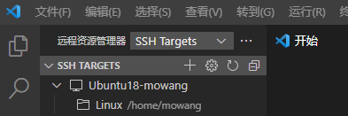
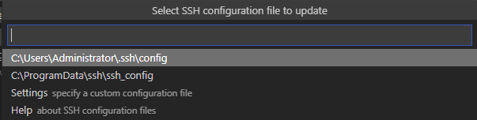
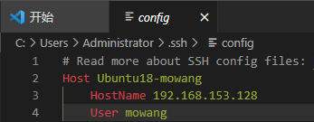

# Linux开发环境搭建
## VScode的SSH连接
1、相关的扩展插件
- Remote Development
2、远程资源管理器
- 安装完相应插件后，vscode会出现 `远程资源管理器` 选项
- 在左上角选项卡中选择 `SSH Targets` ，进到相应远程操作连接界面
- **配置文件**
    - 
    - 点击 “⚙”进入到选择 `SSH configuration` 界面，选择第一个路径下的配置文件
        - 
    - 配置文件说明
        - 
        - `Host` 为本地远程命名（可自定义）
        - `HostName` 远程虚拟机的地址
        -` User` 为被远程主机的用户名

## Xshell安装
- 主要针对xshell6版本
- 出现问题
    - 首次安装后打开Xshell时弹出“要继续使用此程序，您需要应用最新或使用新版本“
- 解决方法
```
关闭弹窗；
打开Xshell 6的软件安装目录，找到相应的dll文件 <nslicensse.dll>；
将<nslicensse.dll>复制粘贴备份生成一个副本，然后将文件名称改为<nslicense-bak.dll>；
用sublime文本编辑器打开<nslicense.dll>文件，找到"0f86 8100 0000 33c0"，大概在869行，将此处的"0f86"改为"0f83"；
重新打开软件即可正常使用。
```