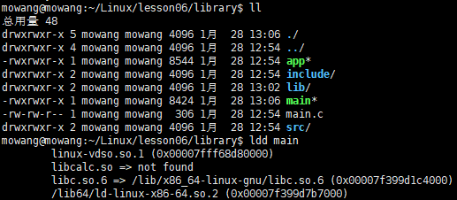

# 动态库的制作和使用
## 动态库制作
### 命名规则
- Linux： `libxxx.so`
    - lib ：前缀（固定）
    - xxx : 库的名字，自定义
    - .so ：后缀（固定）
    - 🐖 在Linux下是一个可执行文件
- windows：`libxxx.dll`
### 制作命令
- gcc 得到 .o 文件，得到**和位置无关**的代码
    - `gcc -c -fpic/-fPIC a.c b.c`
    - `-fpic`和`-fPIC`
    ```
  -fPIC与-fpic都是在编译时加入的选项，用于生成位置无关的代码(Position-Independent-Code)。
  这两个选项都是可以使代码在加载到内存时使用相对地址，所有对固定地址的访问都通过全局偏移表(GOT)来实现。这正好满足了共享库的要求，共享库被加载时地址不是固定的。
  -fPIC和-fpic最大的区别在于是否对GOT的大小有限制。-fPIC对GOT表大小无限制，所以如果在不确定的情况下，使用-fPIC是更好的选择。
  如果不加-fpic ，那么生成的代码就会与位置有关，当进程使用该.so文件时都需要重定位，且会产生成该文件的副本，每个副本都不同，不同点取决于该文件代码段与数据段所映射内存的位置。
    ```
- gcc 得到动态库
    - `gcc -shared a.o b.o -o libxxx.so`
    
## 动态库加载使用
### 对于动态库加载失败的原因
#### 动态库加载报错信息
- 根据上文制作的动态库，直接用加载其编译的可执行文件直接运行会报错，提示如下图所示
    - 
    - 报错信息：加载共享库发生错误，无法找到动态库文件。
#### 失败原因
- 与库加载原理有关
         
#### 解决方法
-  在 `ld-linux.so` 搜索路径（环境变量）下添加动态库的绝对路径  
- 方法一：配置环境变量
    - 方式一：临时配置环境变量（重新打开终端后失效）
        - `export LD_LIBRARY_PATH=$LD_LIBRARY_PATH:动态库绝对路径`
        - 绝对路径获取命令：`pwd`
        - 查看环境变量命令：`echo $LD_LIBRARY_PATH`
    - 方式二：永久配置，分为用户和系统两种配置级别
        - 用户级别
            - 进入到home目录下，命令：`cd`；
            - `ll`，查看 <.bashrc>；
            - 配置<.bashrc>，`vim .bashrc`；
            - `shift+g`，跳至文件最后一行，按 `o` 往下插入一行： `export LD_LIBRARY_PATH=$LD_LIBRARY_PATH:动态库绝对路径`；
            - 保存修改并退出，`esc`+`:wq`；
            - 使配置生效， `.  .bashrc` 或 `source .bashrc` ；
        - 系统级别
            - 获取权限，修改 `/etc/profile`，相关命令为：`sudo vim /etc/profile` ；
            - `shift+g`，跳至文件最后一行，按 `o` 往下插入一行： `export LD_LIBRARY_PATH=$LD_LIBRARY_PATH:动态库绝对路径`；
            - 保存修改并退出，`esc`+`:wq`；
            - 使配置生效， `source /etc/profile` ；
- 方法二：配置 `/etc/ld.so.cache` 文件
    - `sudo vim /etc/ld.so.conf`
    - 将动态库的绝对路径配置到 <ld.so.conf> ，按 `esc`+`:wq` 保存退出，
    - 更新配置：`sudo ldconfig`;
- 方法三：将动态库文件放置到/lib/或/usr/lib目录下，
    - 此方法不建议使用，因这两个文件中含有较多的系统文件，容易错误操作系统原有自带文件。

### 工作原理
- 静态库：GCC进行链接时，会把静态库中代码打包到可执行程序中。
- 动态库：GCC进行链接时，动态库的代码不会被打包到可执行程序中
- 程序启动之后，动态库会被动态加载到内存中，通过`ldd xxx` （list dynamic dependencies）命令检查动态库依赖关系，其中xxx为可执行文件名称。
- 如何定位共享库文件呢?
    - 当系统加载可执行代码时候，能够知道其所依赖的库的名字，但是还需要知道绝对路径。此时就**需要系统的动态载入器（ld-linux.so）来获取该绝对路径**。是专门用来负责定位、加载程序所需要的所有动态库文件。现在的Linux操作系统的可执行程序基本上都是ELF格式的，至于其它的格式，或者古老的一些程序格式是怎么加载的，咱们就没必要去深究了，这个动态载入器作为了解即可。
    - 对于elf格式的可执行程序，是由ld-linux.so来完成的，它先后搜索elf文件的 `DT_RPATH` 段—> 环境变量`T.D_LIBRARY_PATH` —> `/etc/ld.so.cache` 文件列表—>/lib/，/usr/lib目录找到库文件后将其载入内存。
    
## 静态库和动态库的对比
### 程序编译成可执行程序的过程

- 静态链接方式中，静态库代码已经加载到了可执行文件中；
- 动态链接方式中，动态库代码并不会打包到可执行文件中，而是打包动态库的信息（如名称）至可执行文件，在可执行文件运行时通过这些信息找到动态库加载到内存当中。

### 制作过程
#### 静态库制作

- 通过ar指令将目标文件 <.o> 打包成库文件 <libxxx.a>；
- 静态库使用时，需要将静态库和对应头文件同时发送给使用方，通过头文件导入使用静态库中的api（函数）。

#### 动态库制作


### 优缺点和使用场景
#### 使用场景
- 当库非常小时，一般使用静态库；库比较大时，一般使用动态库
#### 静态库优缺点

##### 优点
```
静态库被打包到应用程序中加载速度快；
发布程序无需另外提供静态库，移植方便
```
##### 缺点
```
消耗系统资源，浪费内存；
更新、部署、发布麻烦；
```
#### 动态库优缺点

##### 优点
```
可以实现进程间的资源共享（共享库）；
更新、部署、发布简单；
可以控制何时加载动态库；
```
##### 缺点
```
加载速度比静态库略慢；
发布程序时需要提供依赖的动态库；
```
