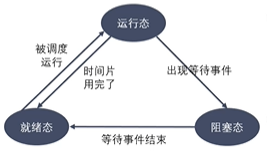

# 进程状态转换
## 进程的状态
- 进程状态反应进程的执行变化。这些状态随着进程的执行和外界条件的变化而转换。
- 在 **三态模型** 中，进程分为三个基本状态，即就绪态、运行态、阻塞态。
    
    
- 在 **五态模型** 中，进程分为 **新建态**、就绪态、运行态、阻塞态、**终止态**。
    - 运行态：进程占有处理器正在运行
    - 就绪态：进程具备运行条件，等待系统分配处理器以便运行。当进程已分配到除CPU以外的所有必要资源后，只要再获得CPU，便可立即执行。
        - 在一个系统中，处于就绪状态的进程可能有多个，通常将它们排成一个队列，称为 **就绪队列**。
    - 阻塞态：又称为等待（wait）态或者睡眠（sleep）态，指进程不具备运行条件，正在等待某个事件的完成。
    - 新建态：进程刚被创建时的状态，尚未进入就绪队列
    - 终止态：进程完成任务到达正常结束点，或出现无法克服的错误而异常终止，或被操作系统及有终止权的进程所终止的状态。
        - 进入终止态的进程不再执行，但依然保留在操作系统中等待善后。一旦其他进程完成了对终止态进程的信息抽取之后，操作系统将删除该进程。

## 进程相关命令
### 查看进程
- `ps aux/ajx`
    - 命令解释
        - a：显示终端上的所有进程，包括其他用户的进程
        - u：显示进程的详细信息
        - x：显示没有控制终端的进程
        - j：列出与作业控制相关的信息
        - ps：报告 **当前** 所有进程的快照，非动态显示
    - 显示信息
        - ps ajx
        
        - ps aux
        
        - STAT——状态参数
        
        - START——开始时间参数
        - TIME——持续时间参数
        - PID——进程ID
        - PPID——父进程ID（比如A进程产生了子进程B，当前进程B的ID是PID，PPID是A进程的进程号）
        - PGID——进程组ID
        - SID——会话ID

### 实时显示进程动态
- `top`
    - 命令解释
        - 可以在使用 `top` 命令时加上 `-d` 来指定显示信息更新的时间间隔，在 `top` 命令执行后，可以按以下按键对显示的结果进行排序
        - M：根据内存使用量排序
        - P：根据CPU占有率排序
        - T：根据运行时间长短排序
        - U：根据用户名筛选进程
        - K：输入指定的PID杀死进程
        - q：退出

### 杀死进程
- `kill [-signal] pid`
    - 根据进程id（pid）杀死进程，[-signal]表示信号 
- `kill -l`
    - 列出所有信号
- `kill -SIGKILL 进程ID`
- `kill -9 进程ID`
    - 加 -9  表示的是 9 号信号。其实kill并不是杀死进程，而是发送信号，而 9 号信号能够强制杀死进程，其它的信号有的可以有的不可以。
- `killall name`
    - 根据进程名杀死进程

## 进程号和相关函数
- 每个进程都由进程号来标识，其类型为 pid_t（整型），进程号的范围: 0~32767。进程号总是唯一的，但可以重用。当一个进程终止后，其进程号就可以再次使用。
- 任何进程（除init 进程）都是由另一个进程创建．该进程称为被创建进程的父进程对应的进程号称为父进程号(PPID)。
- 进程组是一个或多个进程的集合。他们之间相互关联，进程组可以接收同一终端的各种信号．关联的进程有一个进程组号(PGID)。默认情况下，当前的进程号会当做当前的进程组号
- 进程号和进程组相关函数
    - `pid_t getpid(viod);`
        - 获取当前进程id
    - `pid_t getppid(viod);`
        - 获取当前进程父进程id
    - `pid_t getpgid(pid_t pid);`
        - 参数不存在时，获取当前进程对应；当传递一个进程号pid作为参数时，则获取该pid所属进程组的进程组号

