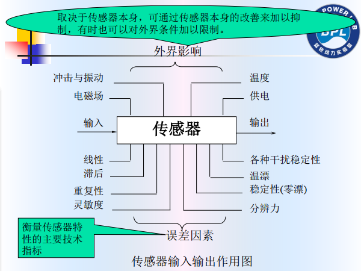

# 检测技术基本理论
## 国际单位制（SI）
- 7个基本单位分别赋予7个基本量
    - 
- 我国法定计量单位以国际单位制为基础
    - 7个基本量
    - 2个辅助单位
    - 19个导出单位
    - 16个十进倍数或十进分数的词头
        - 

### SI基本单位
#### 米（m）
- 真空中的光在（1/299792458）秒内所经过的距离的长度是1米
- 该标准的复制精度可达 $10^{-9}$ 数量级

#### 千克（kg）
- 1千克定义为国际千克原型器的质量
- 保存在法国巴黎塞夫勒博物馆中的一根铂铱
合金圆柱体
- 复制精度可达 $10^{-9}$ 数量级

#### 秒（s）
- 1秒被定义为铯133原子基本态的两个超精细结构能级间跃迁所对应的周期时间的9192631770倍（1967年）
- 🐖 光年（距离单位）
    - 太阳与比邻星距离4.2光年
    - 银河系跨幅阔度10万光年
    - 高倍射电望远镜实际观测到类星体天狼巨星在200亿光年外
    - 宇宙直径可能为600亿光年

#### 安培（A）
- 1安培定义为流经在真空中两根平行且相距1m的无限长直导线（其圆横截面可忽略不计)上并能在其每米长导线之间产生 $2×10^{-7}N$ 的电动力的不随时间变化的电流量（(1948年)

#### 开尔文（K）
- 1开尔文被定义为水的三态点的热力学温度的273.16分之一(1967年)
- 绝对零度，即-273.15℃，当达到这一温度时有的原子和分子热运动都将停止。
- 摄氏温度和华氏温度的关系
    - $T(°F)=1.8t(℃)+32$

#### 摩尔（mol）
- 1摩尔的定义是：一个由确定成份组成的系统。如果它含有粒子的个数等于碳12原子核的12g重量中所含原子的个数，则该系统的物质量为1摩尔（1971年），约 $6.02\times10^{23}$ 个微粒。

#### 坎德拉（cd）
- 1坎德拉被定义为在101325N/m2的气压和铂开始凝固的温度下垂直照射在表面积为 $1/600000m^2$ 辐射黑体上的光强（1967年）

## 检测系统的基本特性
- 🐖 传感器特性主要是指输出与输入之间的关系
    - 静态特性
        - 当输入量为常量（不随时间变化而变化，不等于不变化），或变化极慢时，这一关系称为静态特性
    - 动态特性
        - 当输入量 **随时间** 较快地变化时，这一关系称为动态特性
            - 两种常见的随时间变化
                - 阶跃变化
                - 高频信号

### 传感器的基本特性
- 传感器的输入输出作用
    - 
- 输入/输出关系
    - 对于一个单输入单输出系统， 不考虑输入量随时间的变化， 可用下式描述
    - $Y=a_0+a_1x+a_2x^2+a_3x^3+…+a_nx^n
        - 一般使用线性描述，高次的关系输出对应的输入不具有唯一对应关系，且处理近似时难度大
- 一般的工程测试问题总是处理输入量 x(t)、系统的传输转换特性（规律）和输出量 y(t) 三者之间的关系;
  - 
    - （在传感器设计和测试场景中）当输入、输出是可测量的（已知），可以通过它们推断系统的传输特性。(**系统辨识**）
    - （使用过程中）当系统特性已知，输出可测量，可以通过它们推断导致该输出的输入量。（ **反求**）
    - 如果输入和系统特性已知，则可以推断和估计系统的输出量。（预测）
- 🐖 一定要搞清楚测量系统中的输入和输出目标

### 静态特性
#### 线性度
- 线性度（非线性误差）
    - 
        - 满量程输出 $y_{FS}$
            - 比较传感器性能一定要考虑满量程输出，与测量的相对误差息息相关
        - 最大非线性绝对误差 $\Delta L_{max}$
- 直线拟合（得到理想曲线）方法
    - 
    - 最小二乘法
- 线性度（非线性误差）定义
    - 通过①根据数据绘制曲线和②进行直线拟合，由此产生的特性曲线和你和直线之间的最大偏差
    - 线性度通常取最大偏差和其满量程输出（输出满度值）的比值
        - $\gamma_L=±(\Delta_{L_{max}}/y_{FS})\times 100%$
- 注意
    - 拟合直线的斜率就是 **灵敏度**
    - 🐖 先有近似直线，然后才有非线性误差
    - **二乘法** 是较好的直线拟合方法
        - 将设现有n组数据 $(x_i, y_i)$，待求直线为：$y=kx+b$，则
        - 

##### 差动法——补偿非线性
- 
    - 通过正负对称的输入/输出量，得到 $\Delta Y$ 转换成只含有奇次项
- 正负对称输入量的获取

#### 灵敏度
- 灵敏度S
    - 定义：单位输入变化量引起输出变化量的关系
        - $S=\frac{\Delta y}{\Delta x}$
        - $\Delta y$是输出变化量，$\Delta x$ 是输入变化量
    - 传感器输出你和直线的 **斜率** 就是灵敏度
    - 对线性特性的传感器，曲线的斜率相同，灵敏度是常数，与输入量大小无关
        - 🐖 与量程没有必然联系，不同于重复性和线性度中涉及的满量程输出
- 灵敏度反映了测量系统对输入信号变化的一种反应能力，是有量纲的。
    - 
- 假设某个线性检测系统由n个环节串联组成,每个环节的灵敏度分别是S1,..., Sn，则系统的总灵敏度是
    - $S=S_1*S_2*...S_n$

#### 重复性
- 同一条件下，对同一被测量，同一方
向，多次重复测量，差异程度
    - 
- 重复性是检测系统最基本的技术指标，是其他各项指标的前提和保证，尤其对于高精度测量任务。
- 重复性
    - 表示测量系统在同一工作条件下，按同一方向作全量程多次（三次以上）测量时,对于同一个激励量其测量结果的不一致程度。<mark>用正、反行程 **最大** 偏差与满量程输出的百分比</mark>来表示,即
    - 

#### 滞后度
- 滞后度（回程误差或变差）
    - 传感器在正（输入量增大）反（输入量减小）行程中输出输入曲线不重合称为迟滞
    - 
    - 一般是回程（输入量减小）过程中变化速率减慢形成的 $h_i$ 

#### 分辨率

## 检测系统的测量方法

## 检测系统的测量误差

