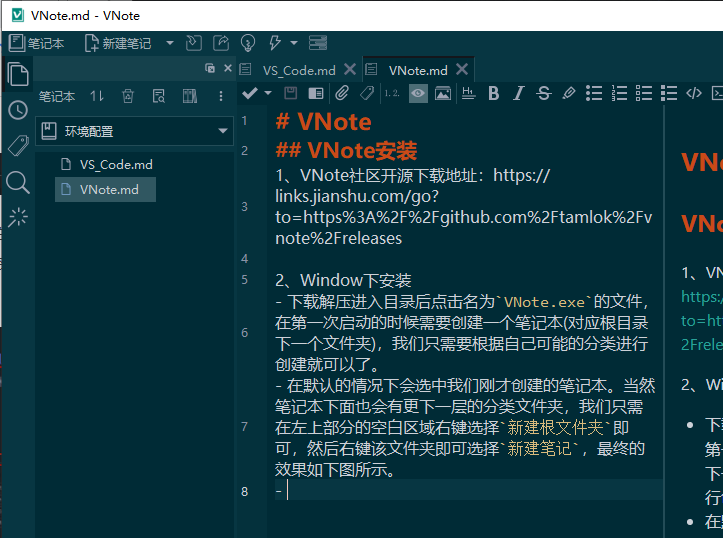
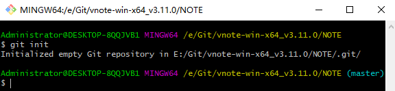
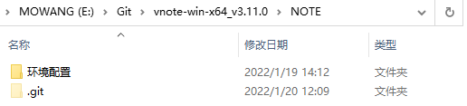
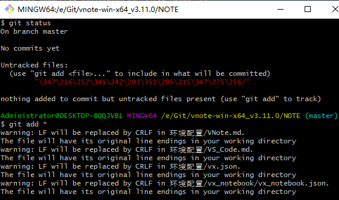
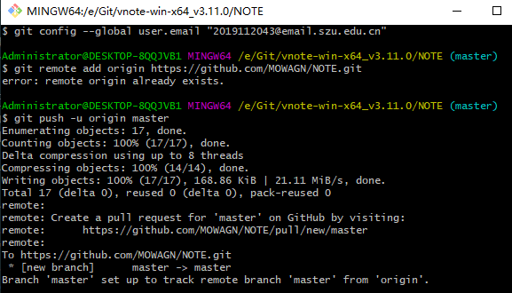

# VNote
## VNote安装
1、VNote社区开源下载地址：https://links.jianshu.com/go?to=https%3A%2F%2Fgithub.com%2Ftamlok%2Fvnote%2Freleases

2、Window下安装
- 下载解压进入目录后点击名为`VNote.exe`的文件，在第一次启动的时候需要创建一个笔记本(对应根目录下一个文件夹)，我们只需要根据自己可能的分类进行创建就可以了。
- 在默认的情况下会选中我们刚才创建的笔记本。当然笔记本下面也会有更下一层的分类文件夹，我们只需在左上部分的空白区域右键选择`新建根文件夹`即可，然后右键该文件夹即可选择`新建笔记`，最终的效果如下图所示。

- Vnote本身并没有提供markdown实时预览功能，不过这需求也因人而异，如果想看到效果，也可以通过快捷键 `Ctrl+t` 进行切换。

3、搭建GitHub环境
- 创建GitHub账号
- 在创建的文件夹 `日记` ，邮件可以看到选项 `打开文件夹所在位置` 的选项，可以看到本地VNote的文件夹位置
- 要将笔记同步到GitHub，需现在GitHub上创建一个同名仓库（文件夹），可以选择设置为公有或者私有仓库
<<<<<<< HEAD
- 🐖 建立选项中，建立的是共仓库，即不要勾选“使用Readme 文件初始化这个仓库”

=======
>>>>>>> 346a7310638ce4ec3bb68f48cc8555f92c471eb1

4、Git工具
- 下载地址：https://gitforwindows.org/
- 工具特点：能够对它所的文件夹内的变化进行实时监控并记录
- 实现功能特点前提：将Git初始化到要监控的文件夹里面。对应操作为：在笔记文件夹的空白区域右键，然后点击 `Git Bash Here` ，在出现的对话框中输入 `git init` 即可，点击 `Enter` 初始化，初始化后界面如下，可以在对应路径多一个 `.git` 文件夹


- 查看本地有改动的文件的git命令:  `git status` 。
    - 下图红字部分标注的为有变化的文件
- 对有修改的文件进行确认的git命令： `git add *` 。

- 为修改添加备注的git命令： `git commit -m "<对本次修改进行备注的内容>"`
- 修改（初始化）文件同步至仓库的位置，复制仓库HTTPS地址，告诉本地git指定远程同步仓库地址命令 `git remote add origin 地址` 
    - 在此之需要git先认证github账户
        - 配钥匙（作用是连接电脑的git和GitHub），
        ```
        运行git命令 ：
        $ ssh-keygen -t rsa -C "your_email@youremail.com" //注意啊孩子，双引号里面是你的邮箱。填你常用的就行。还有enter代表执行，之后提示不断按Enter至下次输入命令行为止。
        执行完后可以在 C:\Users\Administrator\.ssh 目录下找到< .pub>格式文件。
        记事本打开 <.pub> 文件复制全部内容，打开github网页，进到账户设置（“setting->SSH and GPG keys->New SSH key”）粘贴刚刚复制的密钥。
        ```
        - 设置用户名和邮箱
        ```
        $ git config --global user.name "your name"
        $ git config --global user.email "your_email@youremail.com"
        ```
        
- 同步上传命令 `git push origin master` （仅需执行一次，本地仓库会记住），出现如下情况则表示同步成功，刷新github页面即可看到更新

## VNote同步操作
```
git init  //初始化仓库
git status  //查看本地有改动的文件
git add * //将当前文件夹下文件提交到本地仓库
git commit -m "备注"   //为本次提交添加备注
git push origin master  //将本次提交同步到GitHub
```

