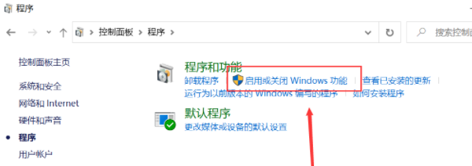
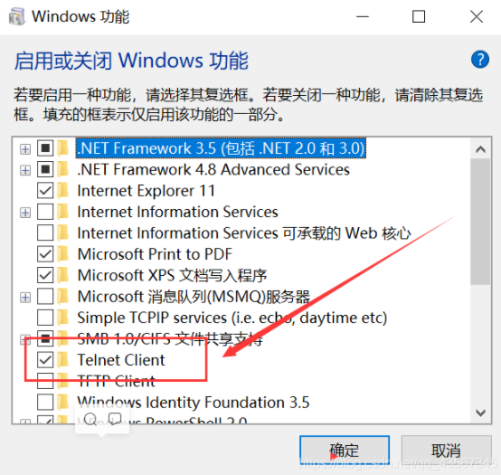
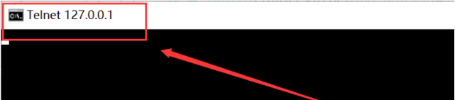
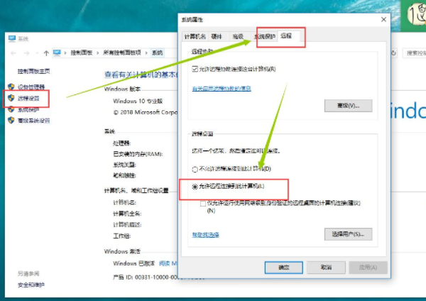
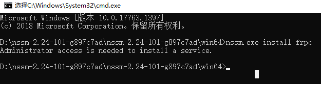
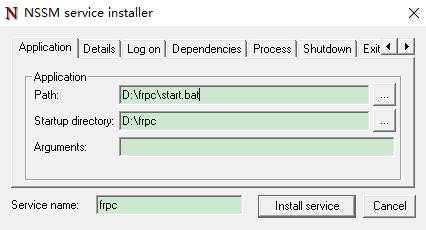
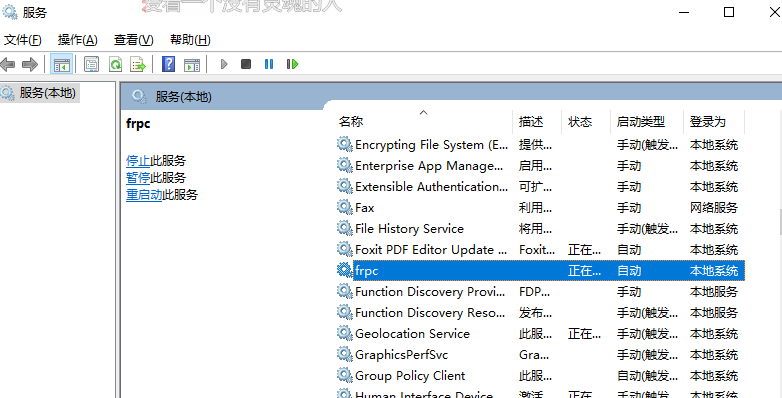
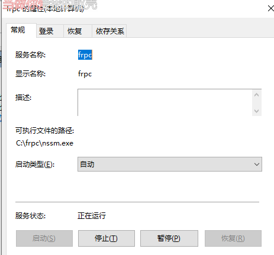
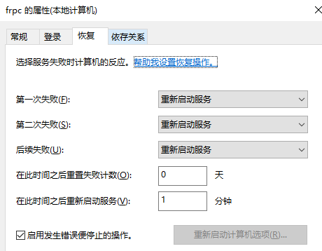

# 远程环境搭建
## 前期工具准备
```
远程公网服务器（具有公网IP），本方案使用云服务器
frpc（下载地址：https://github.com/fatedier/frp/releases）
windows软件进程守护软件NSSM（下载地址：http://nssm.cc/download）
```
## 服务器端
## 客户端（PC）
### frpc.ini文件配置
```
#[common为公共配置区域必须存在]
[common]
# 与服务端连接令牌
token = asdffdsa
# 客户端标识
user = local2
#服务端的访问地址(可用ip或者域名)。
server_addr = 119.91.125.194

####################此处为common的默认配置区域无需修改###################
#服务端用于穿透的端口，与服务端保持一致。
server_port = 7000
# 日志记录路径
#log_file = ./frpc.log
# 日志记录级别(trace, debug, info, warn, error)
log_level = info
# 日志记录滚动天数
log_max_days = 3
# frpc客户端管理界面
#admin_addr = 127.0.0.1
#admin_port = 7400
#admin_user = admin
#admin_passwd = admin
# 连接池
pool_count = 5
# tcp数据流多路复用，默认开启，服务端客户端需要保持一致
#tcp_mux = true
# 失败重连
login_fail_exit = false
# 服务端与客户端通信协议，支持tcp\upd
protocol = tcp
# dns服务选用
# dns_server = 8.8.8.8
#客户端向服务端心跳检查间隔与超时时间
heartbeat_interval = 10
heartbeat_timeout = 90
##############以上为客户端服务的公共信息配置区域############
 
###############具体的穿透服务功能启用(表示你要使用frp的那个功能)##############
[app1]
type = tcp
local_ip = 127.0.0.1
local_port = 3389
remote_port = 13389
```
### 防火墙端口设置
- 端口说明
```
local_port 是默认的远程端口
remote_port 是mstsc（远程设备）请求公网时，在公网地址加上此端口，则可远程连接到此装有frpc的设备
```
- 端口设置步骤
```
通过 <控制面板控制面板\所有控制面板项\Windows Defender 防火墙> 或者 <网络和Internet\防火墙和网络保护\高级设置> 进入到高级设置界面。
新建入站规则（操作->新建规则->规则类型（端口）->协议和端口（TCP，特定本地端口）->默认下一步->名称设置->完成。
在入站规则列表中可以找到添加的入站规则，端口配置完成。
```
### 远程选项设置
#### 启用Telnet Client
- Telnet协议是TCP/IP协议族中的一员，是Internet远程登录服务的标准协议和主要方式。
- 启动操作
    - 控制面板-程序
    - 点击“启动或关闭Windows功能”
     
     - 默认情况下是关闭状态，勾选“Telnet客户端”，点击“确定”。打开Telnet客户端
     
     - 无需重启
- 用telnet测试远程端口是否开放
    - 打开命令行窗口 `win + R`  输入：`cmd`，输入命令： `telnet 127.0.0.1 [端口号]` （如： `telnet 127.0.0.1 3389` ）
    - 出现如下界面则证明远程端口已经开放
    
    
#### 启用远程设置
- 控制面板->所有控制面板选项->远程设置->系统属性面板->远程选项


### NSSM注册frpc客户端为服务
#### NSSM概述
- NSSM 是一个服务封装程序，它可以将普通 exe 程序或 Nodejs 项目封装成服务，像 windows 服务一样运行。同类型的工具还有微软自己的 srvany，不过 nssm 更加简单易用，并且功能强大。它的特点如下：
    - 支持普通 exe 程序（控制台程序或者带界面的 Windows 程序都可以）
    - 可以自动守护封装了的服务，程序挂掉了后可以自动重启
    - 可以重定向输出（并且支持 Rotation）和自定义环境变量
#### frpc.exe注册为服务操作
- 下载地址：http://nssm.cc/download
    - 以下载 nssm 2.24-101-g897c7ad (2017-04-26)软件为例
    - 解压 nssm-2.24-101-g897c7ad文件夹，在win64目录下复制 `nssm.exe`，粘贴至 `frpc.exe` 和 `frpc.ini` 所在目录下
- frpc目录下新建 `run.bat` 文件，文件内容如下：
```
C:\frpc\frpc.exe -c C:\frpc\frpc.ini
```
- 在frpc目录下输入运行cmd命令
```
nssm.exe install frpc
```

- 在弹出的安装对话框进行如下设置，然后点击Install service,提示successfully,说明安装成功
    - Application选项卡下
    - Path输入run.bat路径（即C:\frpc\run.bat）
    - Startup directory输入frpc路径（即C:\frpc）
    - 修改服务名（Service name）为 `frpc`

- 在系统运行服务查看,设置开机自动运行即可
    - 查看系统运行服务路径如下：
    - 开始→控制面板→管理工具→双击“服务”
    - 或者直接在“运行”(`win+R`)中输入 `Services.msc` 打开服务设置对话框


