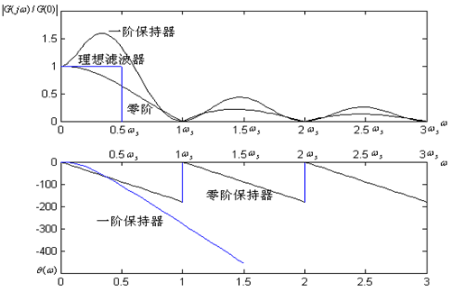

# 采样过程与信号重构
- 采样是数字控制系统的基本特征
- 采样理论包含：单速率和多速率采样
    - 本课程仅讨论单速率采样，即采样周期T为常数

## 引言
### 基本概念
- 采样过程(Sample)：连续信号经采样开关转换为离散时间信号的过程。在数控系统中，是连续偏差信号 e(t) 经采样开关转换为离散时间信号 e*(t) 的过程;
- 信号重构(Signal reconstruction)：离散时间信号转换为连续信号的过程。在数控系统中，是离散时间信号u*(t) 经保持器转换成连续控制信号 u(t) 的过程

### 重点
- 采样过程、信号重构机理及其数学描述
- 采样定理及采样周期T的选择

### 数控系统信号转换示意图及其简化

## 采样过程
- 连续信号 f(t) 通过采样开关后，转变为脉冲序列 f*(t) 的过程

### 时域描述
- 
    - 闭合时间 τ(s) 一般取趋于0
    - 有关重要计算公式
        - $\int_{-\infty}^{+\infty}f(t)\delta(t)dt=f(0)$
        - $\int_{-\infty}^{+\infty}f(t)\delta(t-kT)dt=f(kT)$
- 理想采样过程的时域描述

### 频域描述
#### 预备知识
- 求 $f^*(t)$ 的Fourier变换 $F^*(j\omega)$，即 $f^*(t)$ 的频谱
- 对于周期信号f(t)，当满足Dirichlet条件时，f(t) 可以用一个Fourier级数表示，其频谱 $F(j\omega)$ 是离散的。
- Fourier级数的复系数表达式
    - 
    - 注意：区分 $\omega_o$ 和 $\omega_s$ （采样角频率）
    - 
    - 例一
        - 
        - 
    - 例二
        - 
        - 
        - 
        - 
- 对于非周期信号 $f(t)$，$T\to\infty$，其频谱 $F(j\omega)$ 在 $\omega\in(-\infty, +\infty)$ 上都是连续的，不存在Fourier级数，只能利用Fourier求 $F(j\omega)$
    - 

#### 采样信号 $f*(t)$ 的Fourier变换 $F^*(j\omega)$
- 🐖 采样过程的频域描述表达式
    - $F^*(j\omega)=\frac{1}{T}\sum_{n=-\infty}^{\infty}F(j\omega-jn\omega_s)$
##### 方法一

##### 方法二

#### 理想采样过程频域分析

- 采样过后$\omega=0$ 为低频，其余频率均为高频

- 分析
    - 采样过程中存在时域信息损失，T越小，采样信号越接近连续信号
    - $F^*(j\omega)$ 可分为主频谱（n=0）和高频（n≠0）两部分。信号频谱 $F(j\omega)$ 派生周期为 $\omega_s$ 倍数的无限个高频频谱分量。
    - 当 $\omega_s\>2\omega_m$ 时，在 $F^*(j\omega)$ 频谱中高低频不发生混频现象；否则出现混频现象。
- 示例
    - 
    - 
    - 
    - 
    - 采样频率是$f_s=1Hz$，$\omega_s=2\pi$
    - 
    - $p_1(t)$ 没有发生混频现象，可以唯一确定，$p_2(t)$ 发生混频现象，取低频的主频谱的时候在区间内会混入两个 $±0.2\pi$ 的高频信号，则 $p_2(t)$ 无法通过采样信号确定。

### 采样定理
- 在信号不混叠情况下，即 $\omega_s>2\omega_m$ 时，采用如下低通滤波器可没有失真再现原信号
    - 
- 原理分析
    - 

#### 香农（Shanon）采样定理
- 香农采样定理
    - 若 $\omega_m$ 是模拟信号 f(t) 上限频率，$\omega_s$ 为采样频率，则当 $\omega_s>2\omega_m$ 时，经采样得到的信号能无失真地再现原信号
- 奈奎斯特（Nyquist）频率
    - 即采样频率的下限
    - $\omega_N=\omega_s/2$
- 注意
    - 理想低通滤波器G(s)是不存在的
    - 信号经过采样后只取采样点上的值。当 $\omega_s\leq2\omega_m$，信号发生混频， **不同** 的连续信号可以得到 **相同的采样信号** ，f(t) 的高频信号有可能混叠在低频处，因此不再能不失真地恢复原信号。

## 信号重构
- 信号重构即采样的逆过程
- 主要又两类信号重构法
    - 香农重构法
    - 信号保持法

### 香农重构法
- 信号完全重构的条件为
    - 
    - 
- 上式成立条件
    - 需要信号为有限带宽
    - 采样周期满足采样定理
    - 需要 $k=-\infty\to+\infty$ 的数据（过去和未来数据），物理不可实现，因此不能用于实际数控系统

### 信号保持法（Signal hold）
- 仅由原来时刻的采样值实现信号重构的方法，即因果重构，就是信号保持（signal hold）法，在工程上 **用保持器** 实现。
    - 从数学上说，保持器是解决各采样点之间的插值问题，用外推方法——由过去时刻输入的采样值 $[f(kT)，k\leq t/T]$ 外推现时刻 f(t) 。
    - 
    - 若 $a_i≠0 (i=1, 2, ..., n)$ ，则实现上式的保持器称为n阶保持器。参数可由前n+1个时刻的采样值唯一确定。

#### 零阶保持（Zero-order hold）
- 概要
    - 时域描述
        - 
    - 
- 零阶保持器的频率特性
    - 
    - 
    - 
- 不足
    - 具有多个截止频率，能通过高频分量，其相频特性具有相位迟后

#### 一阶保持器
- 概要
    - 时域描述
        - 
    - 
- 一阶保持器的频率特性
    - 
    - 
    - 零阶和一阶保持器比较
        - 

#### 一阶和零阶保持器比较
- 从时域角度分析，用两种保持器重构信号均会产生误差。对零阶保持器，若 f(t) 具有平滑的一阶导数 f'(t)，采样后重构误差可用下式估计:
    - 
- 对一阶保持器，若 f(t) 具有平滑的二阶导数 f''(t)，采样后重构误差可用下式估计：
    - 
- 🐖 对两种保持器来说，随着采样周期的减小，相对误差随之减小。用零阶保持器重构要获得1%的相对误差，每周期需采样300个点。当采样点大于20之后，采用一阶保持器优于零阶保持器。
- 在数字控制中，零阶保持器容易实现，是应用最广泛的一种信号重构法。

## 采样周期的选择
- 香农采样定理给出了T的上限
- 数控系统实时性给出了T的下限
    - 采样频率越高，系统控制越及时，对系统动态性能有利。但T 选得过小，计算机负担过重，且不利于满足实时性要求。
- 靠经验选择
    - 如伺服系统中选择 $\omega_s\geq 6~10\omega_c$
- 实际应用中，为防止采样过程中出现混叠现象，高频可能以低频出现，可在采样之前设置一前置低通滤波器，这样高于奈奎斯特频率的信号就会得到衰减，可以减少混叠现象对数控系统的影响。

