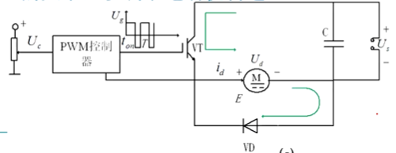

# 转速开环控制的直流调速系统
## 直流电动机
### 🐖 直流电动机的稳态特性

- 调整R实现的有级调速
- 调整U实现的是无级调速，是希望调速系统理想实现形式

### 调节直流电动机转速的方法
1. 调节电枢供电电压
2. 减弱励磁磁通
3. 改变电枢回路电阻
- 自动控制的直流调速系统往往以 **变压调速** 为主

## 晶闸管整流器-直流电动机系统的工作原理及调速特性
- 晶闸管整流器-直流电动机系统又称”V-M系统“

### 触发脉冲相位控制

- 工作流程
    - 调节控制电压$U_c$
    - 移动触发装置GT输出脉冲的 **相位**
    - 改变可控整流器VT输出瞬时电压$u_d$的波形，以及输出平均电枢电压$U_d$ 的数值
- 理想情况下，$U_d$ 和$U_c$之间存在线性关系：

- **瞬时电压平衡方程式**

- V-M系统主电路的等效电路图
    
- 🐖 晶闸管整流器的特点
    - 利用触发脉冲的相位角α控制整流电压的平均值
- 对一般的全控型整流电路，当电流波形连续时
    - 
    - 式中
        - α——从自然换相点算起的触发脉冲控制角
            - 控制角由$U_c$控制
        - $U_m$——α=0时的整流电压波形峰值
        - m——交流电源一周内的整流电压脉冲波数
    - 对于α
        - 当$\alpha\in(0, \pi/2)$，$U_{d0}>0$，处于整流状态，功率从交流到直流
        - 当$\alpha\in(\pi/2, \pi)$，$U_{d0}<0$，电能从直流到交流部分，处于逆变状态
    - 不同整流电路的整流电压波峰值、脉冲数及平均整流电压
        - 

### 电流脉动机器波形断续问题

- 预备知识
    - 电流脉动主要与电感元件L有关，电感的能量是有限的，当$u_d=E$时，是电枢电流的最大值，之后会慢慢下降（因为电感对电流的维持能力随着能量释放减弱）
    - 波形断续情况是由于电感的容量太小引起的。
- 电流连续
    - 
- 电流断续
    - 
- 抑制电流脉动措施
    1. 增加整流电路相数，或采用多重化技术
        - 把若干个整流电路的输出按一定的相位差组合起来，使得他们所含的某些主要谐波分量相互抵消，得到想要的波形
    2. 设置电感量足够大的平波电抗器

### 晶闸管整流器-直流发电机系统的机械特性
- 电流波形连续
    - V-M系统的机械特性方程为
        - $n=\frac{1}{C_e}(U_{d0}-I_dR)$
        - 式中，$C_e$——电动机在额定磁通下的电动势系数$C_e=K_e\Phi_N$.
        - 因为$U_{d0}$和控制电压$U_c$有线性关系$U_{d0}=K_SU_C$，则机械特性作线性近似可得
            - $n=\frac{1}{C_e}(K_SU_C-I_dR)$
    - 机械特性图像
        - 
        - 在第一象限中，随着α增大，$U_C$下降
        - 虚线部分为非线性部分，即断续
- 完全V-M系统机械特性
    - 
    - 在电流连续区，显示出 **较硬** 的机械特性
        - 机械特性硬，即表现为即使负载变化很大，转速变化依旧很小
    - 在断续区，机械特性很软，理想空载转速翘的很高

### 晶闸管触发和整流装置的传递函数
- 实际的晶闸管触发电路和整流电路的特性是 **非线性** 的
- 在设计调速系统时，**只能在一定的工作范围内近似看成线性环节**，得到它的放大系数和传递函数后，用 **线性控制理论** 分析整个系统

#### 放大系数$K_s$计算

- 通过实验测定输入（控制电压$U_C$）和输出（整流电压$U_d$）的数据
- **晶闸管触发和整流装置的放大系数$K_s$由工作范围内的特性斜率决定**
    - $K_s=\frac{\Delta U_d}{\Delta U_C}$
- 当没有测试条件时，可以根据装置的参数进行估算

#### 失控时间$T_s$和纯滞后环节
- 动态过程中，晶闸管触发与整流装置看成一个 **纯滞后环节**，这是由晶闸管的 **失控时间** 引起的。
- 晶闸管一旦导通后控制电压的变化在该器件关断以前不再起作用，要等到下一个自然换相点以后，当控制电压所对应下一相触发脉冲来到时才能使整流电压发生变化。
- 失控时间示意图（单相桥式全控整流）
    - 
    - 🐖 整流电压变化会之后于控制电压变化
    - 延时时间是针对整流平均电压的，失控时间是个 **随机值**
    - 最大失控时间是 **两个相邻自然换相点之间的时间**，它与交流电源频率和晶闸管整流器的类型有关
        - $T_{s max}=\frac{1}{mf}$
        - 其中，f 为交流电频率（Hz），m 为一周内整流电压的脉波数
    - 平均失控时间
        - $T_s=\frac{1}{2}T_{S MAX}
        - 若按最严重情况考虑，则为 $T_s=T_{s max}$
    - 失控时间一般会直接给出，只需要知道有失控时间，公式不需要记

#### 晶闸管触发电路与整流装置的传递函数
- 滞后环节的输入用阶跃信号 1(t) 表示，输出要隔一定时间后才出现响应 $1(t-T_s)$
- 输入与输出关系为：
    - $U_{d0}=K_sU_c\times 1(t-T_s)$
- 晶闸管装置的传递函数为
    - $W_s(s)=\frac{U_{d0}(s)}{U_c(s)}=K_se^{-T_ss}$
    - 按泰勒级数展开
        - 
    - 工程近似处理原理下，把整流装置近似看成一阶惯性环节
        - 🐖 $W(s)\approx\frac{K_s}{1+T_ss}$
- 动态结构图
    - 

#### 晶闸管整流器运行中存在的问题
1. 晶闸管是 **单向导电** 的
2. 晶闸管对 **过电压、过电流和过高du/dt与di/dt** 都十分敏感
3. 晶闸管的 **导通角变小** 会使得系统的 **功率因数随之减少**，称为电力公害

### V-M系统的可逆运行

- 对于需要电流正反向的直流电动机可逆调速系统,必须使用两组晶闸管整流装置反并联线路来实现可逆调速
    - 电动机正转时，由正组晶闸管装置VF供电；
    - 反转时,由反组晶呵管装置VR供电。两组晶闸管分别由两套出发装置控制
- 即使不是可逆的调速系统，只要是需要快速的回馈制动，常常也采用两组反并联的晶闸管装置，由正组提供电动机运行所需的整流供电，反组只提供逆变制动
- 在晶闸管-电动机系统中一般不允许两组晶闸管同时处于整流状态，否则将造成电源短路

## PWM变换器-直流电动机系统的工作原理及调速特性
- 直流PWM变换器由全控型电力电子器件构成，采用脉冲脉宽调制控制方式
- 在中、小容量的高动态性能系统中，直流PWM调速系统已经完全取代了V-M系统，主要分为：
    - 不可逆PWM变换器-电动机系统
    - 可逆PWM变换器-电动机系统
    - 此处的不可逆主要是指不能反转，即电枢电压不能反向

### 不可逆PWM变换器-电动机系统
#### 无制动能力系统
- 利用脉冲宽度调制的方法，把恒定的直流电源电压调制成 **频率一定、宽度可变的脉冲电压序列**，从而可以改变平均输出电压的大小，以调节电动机转速
    - 
    - 主电路为直流降压斩波器，电力电子器件为全控型开关器件（如IGBT）
- 工作原理
    - 
    - VT门极由脉宽调制的脉冲电压 $U_g$ 驱动，其脉宽由控制电压 $U_c$ 控制
    - 在一个开关周期内
        - 当 $0\leq t<t_{on}$ ，$U_g$ 为正，VT饱和导通，电动机电枢两端电压极为 $U_g$ 
        - 当 $t_{on}\leq t<T$，$U_g$ 为负，VT关断，电枢电路电流通过VD续流，电枢电压近似为零
    - 直流电动机电枢两端平均电压
        - $U_d=\frac{t_{on}}{T}U_s=\rho U_s$
    - 改变占空比 $\rho(0\leq\rho\leq 1)$ ，即可实现直流电动机的调压调速
        - 
            - $U_c$ 是人为设置的控制电压值
            - $U_{TM}$ 是PWM控制器中锯齿波的电压最大值
            - $U_s$ 是直流电源的电压值
        - 令 $\gamma=\frac{U_d}{U_s}$ 为PWM电压系数，则不可逆变换器中存在 $\gamma=\rho$
            - $U_s$ 为真正提供给电枢电压来源的一个直流电压源
            - $U_d$ 为实际获得的电枢电压
    - 不可逆PWM变换器-直流电动机系统不允许电流反向，续流二极管VD的作用只是为 $i_d$ 提供一个续流的通道，因而没有制动能力。
    - **为了实现电动机的制动，必须为反向电流提供通路**。
        - 要实现转速反向，根据转速公式，需使得加载在电枢的电压＜0
        - 要实现电动机的制动（并不会改变转速方向，仅使转速大小发生变化），需使得电枢电流反向

#### 有制动能力系统
- 有制动电流通路的不可逆PWM变换器-直流电动机系统
    - 
    - VT1和VD2为一组，其中VT1为主管；VT2和VD1的功能是提供反向电枢电流通路，其中VT2为辅助管
    - 

### 可逆PWM变换器-电动机系统

## 稳态调速性能指标和开环系统存在的问题

